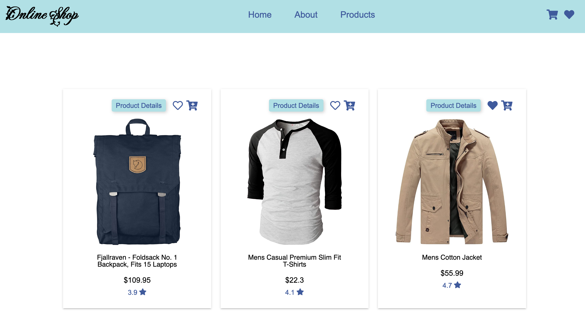

# OnlineShopping

We created this onlineShopping as a final project of JavaScript Course by [ReDI School](https://www.redi-school.org/)


## Overview

Users should be able to:

- View the optimal layout for each page depending on their device's screen size
- See hover states for all interactive elements on the page
- Select products by any category
- See product's details
- Set any product as favorite
- Check all the favorite
- Add and delete products in the cart
- Check the total sum of the products in the cart

### Screenshot




### Link

- Live Site URL: [OnlineShop](https://arianecrestani.github.io/online-shopping/)

## Our process

### Built with

- Semantic HTML5 markup
- CSS custom properties
- Flexbox
- Mobile-friendly
- Vanilla JavaScript
- [Fake Store API](https://fakestoreapi.com/docs)


### What We learned

```js
fetch('http://example.com/.json')
  .then(response => response.json())
  .then(data => console.log(data));

localStorage.setItem('item1', 'item2');
```


## Authors

- linkedin - [Ariane Crestani](https://www.linkedin.com/in/ariane-crestani-14910ba4/)
- linkedin - [Parvaneh Ramezani](https://www.linkedin.com/in/parvaneh-ramezani)
- linkedin - [Tamiris Cristine](https://www.linkedin.com/in/tamiris-cristine/)
​
